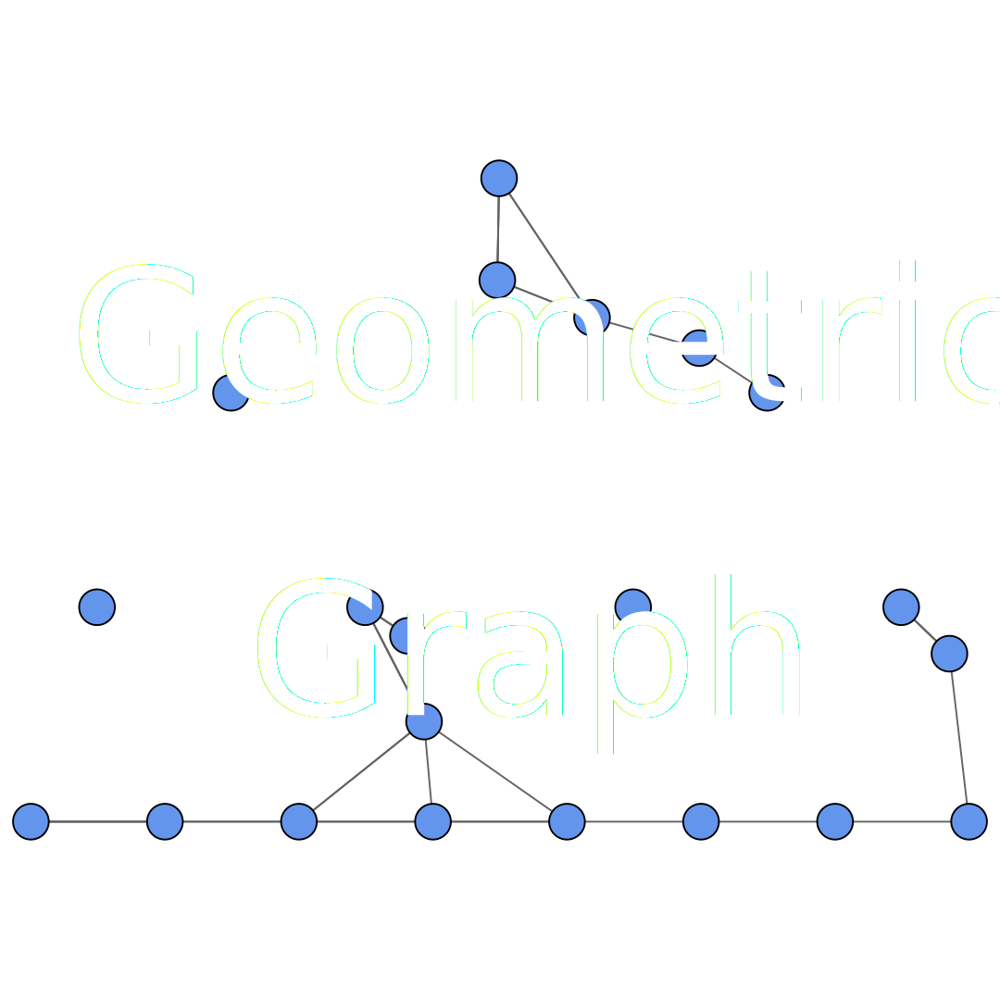

# Network Topology Explorer

Ein interaktives Visualisierungstool zum Erkunden und Experimentieren mit klassischen Netzwerktopologien und Verbindungsalgorithmen.

  

---

## Live-Demo

[👉 Hier ausprobieren](https://andwald.github.io/network-topology-explorer/)

---

## Features

- **Platzieren von Knoten**  
  Klick auf die Zeichenfläche, um einen neuen Knoten zu platzieren.
- **Topologie-Auswahl**  
  Verschiedene Topologien zum Ausprobieren
- **Algorithmus**  
  TODO – erst nach Klick auf **Apply Algorithm** ausgeführt.
- **Import & Export**  
  - **JSON**: Import und Export von Graphen
  - **SVG**: Export als SVG
  - **PNG**: Export als PNG

---
## Unterstützte Topologien

- **Ring**  
  

- **Path**  
  

- **Star**  
  

- **Binary Tree**  
  

- **Random Tree**  
  

- **NNT**  
  

- **Complete**  
  

- **EMST**  
  

- **Delaunay**  
  

- **Gabriel**  
  

- **RNG**  
  

- **GG**  
  

- **Chordal Ring**  
  

---

## Unterstützte Algorithmen

Noch in Entwicklung 

