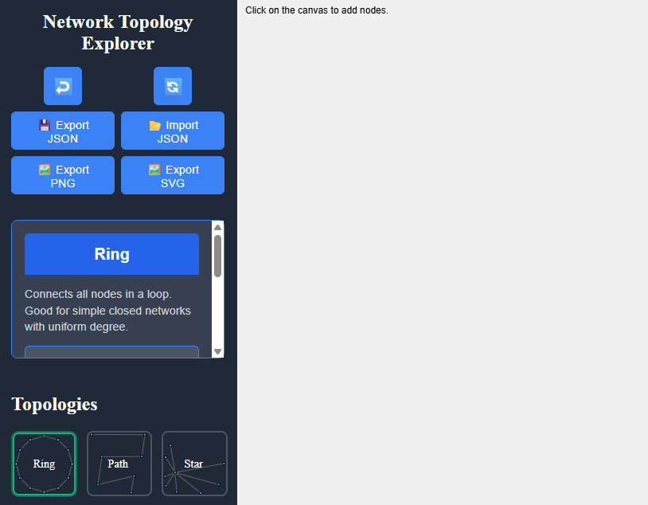

# Network Topology Explorer

Ein interaktives Visualisierungstool zum Erkunden und Experimentieren mit klassischen Netzwerktopologien und Verbindungsalgorithmen.

  

---

## Live-Demo

[👉 Hier ausprobieren](https://andwald.github.io/network-topology-explorer/)

---

## Features

- **Platzieren von Knoten**  
  Klick auf die Zeichenfläche, um einen neuen Knoten zu platzieren.
- **Topologie-Auswahl**  
  Verschiedene Topologien zum Ausprobieren
- **Algorithmus**  
  TODO – erst nach Klick auf **Apply Algorithm** ausgeführt.
- **Import & Export**  
  - **JSON**: Import und Export von Graphen
  - **SVG**: Export als SVG
  - **PNG**: Export als PNG

---
## Unterstützte Topologien

- **Ring**  
- **Path**
- **Star**  
- **Binary Tree** 
- **Random Tree**  
- **Nearest Neighbor Tree**  
- **Complete**  
- **Euclidean Minimum Spanning Tree**  
- **Delaunay**  
- **Gabriel**  
- **Relative Neighborhood Graph**  
- **Geometric Graph**  
- **Chordal Ring**  

---

## Unterstützte Algorithmen

Noch in Entwicklung 

